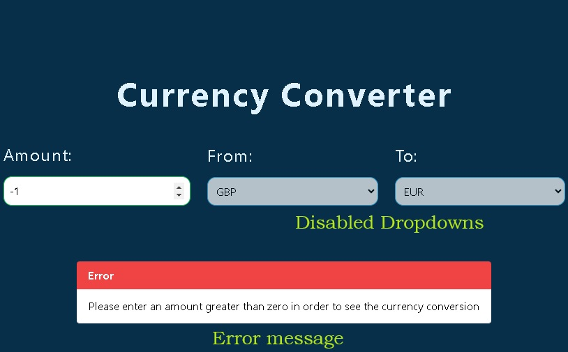

## :notebook_with_decorative_cover: Currency Coverter:notebook_with_decorative_cover:

The Currency Converter allows the user to enter an amount, choose a base and a target curency. Once any of the these values change, the converted amaount will get updated automaticaly as well as the exchange rate for the current exchange. This

If the user enter a negative amount, an error message will appear and also the Currency dropdowns will get disabled until the user enters an amount greater or equal to zero.

If the Base Currency and Taret Currency are the same their values will get swapped (similar behaviour to Google Currency Converter).

The Currency Convert is responsive and the fields change from horizontal to a vertical layout for mobiles, while tablets and larger screens they are on a row.

## :computer: Technologies used:

- React.js

- Typescript

- Vite

- Vitest

- TailwindCSS

- Axios
- Redux Tooklit

## :iphone:Responsiveness

The layout remains horizontal for tablets and desktops and becomes vertical for mobiles

## :exclamation:Validation

When the user enter a negative amount, the exchange rate display text disappears, the dropdowns are getting disabled and an error message appears.

## `:memo:Approach used

- Redux Toolking has been used in order to manage the state and create the actions for the app (store.ts, currencySlice.ts, types.ts). The store file has the store configurattion while the currencySlice defines how the the states are managed. The types file defining the TS types for type safety. Finally the App is getting wrapper with the Provider and the store in order to be able to use it in our project.

- A custom hook 'useCurrencyData' has beeb created in order to fetch the currency data and exchange rates by using Axios and update the redux store with the fetched data.

- The project has been broken down to smaller components (such as CurrencyInput, CurrencySelect, ResultText etc) and each component includes a Vitest test.

- A CurrencyConverterWrapper file has been created which includes the wrapper styles for the Converter.
