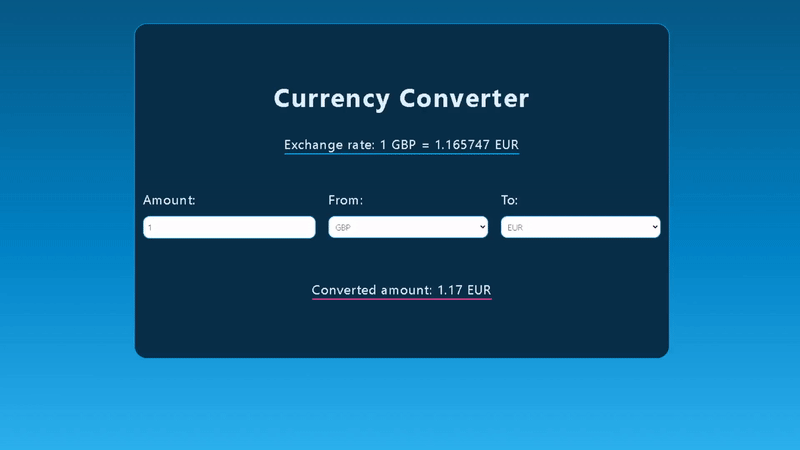
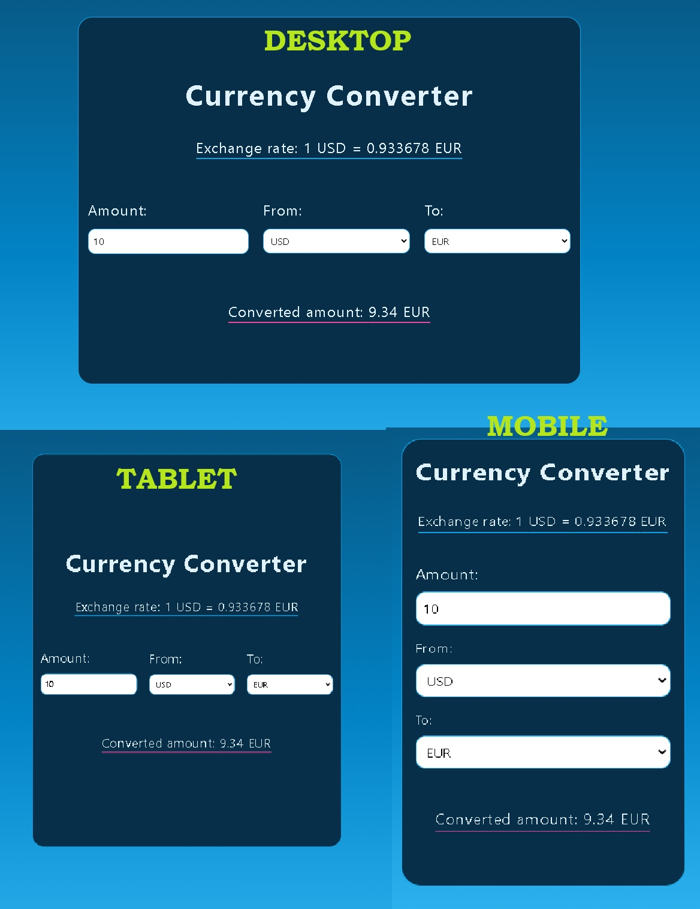

## :notebook_with_decorative_cover: Currency Coverter:notebook_with_decorative_cover:

The Currency Converter allows the user to enter an amount, choose a base and a target curency. Once any of the these values change, the converted amaount will get updated automaticaly as well as the exchange rate for the current exchange. This

If the user enter a negative amount, an error message will appear and also the Currency dropdowns will get disabled until the user enters an amount greater or equal to zero.

If the Base Currency and Taret Currency are the same their values will get swapped (similar behaviour to Google Currency Converter).

The Currency Convert is responsive and the fields change from horizontal to a vertical layout for mobiles, while tablets and larger screens they are on a row.

## :computer: Technologies used:

- React.js

- Typescript

- Vite

- Vitest

- TailwindCSS

- Axios
- Redux Tooklit

## :iphone:Responsiveness

The layout remains horizontal for tablets and desktops and becomes vertical for mobiles

## :exclamation:Validation

## `:memo:Approach used
